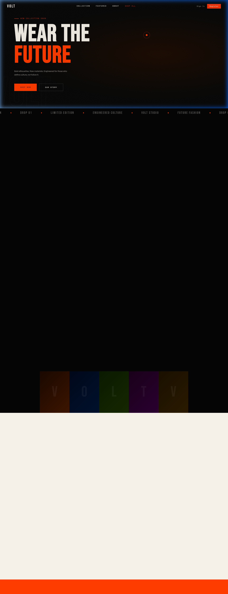
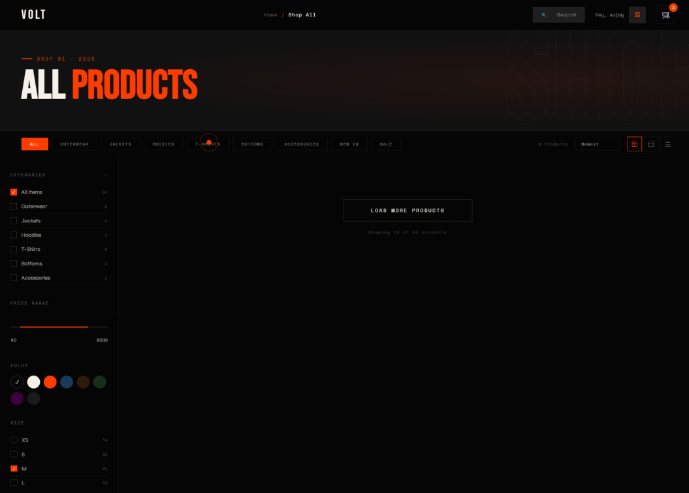
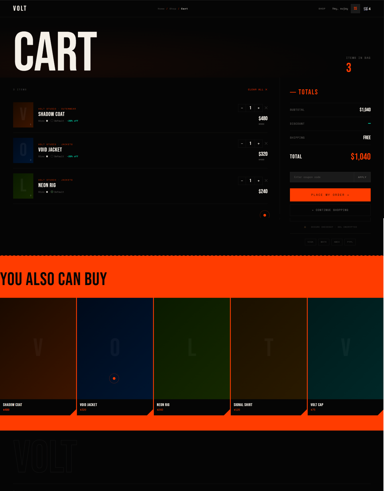
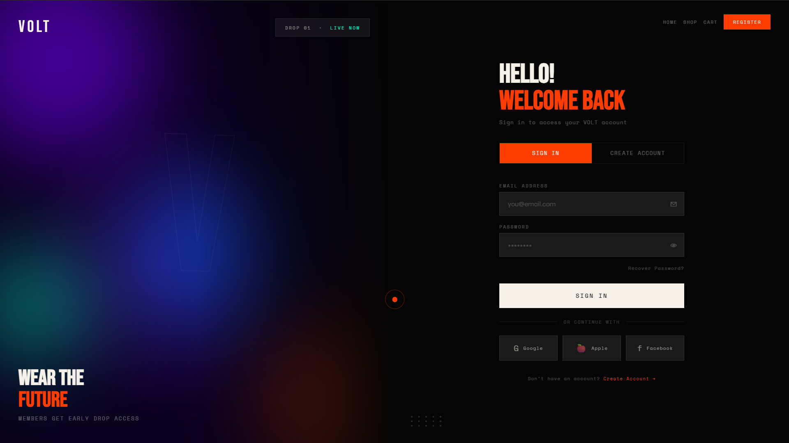
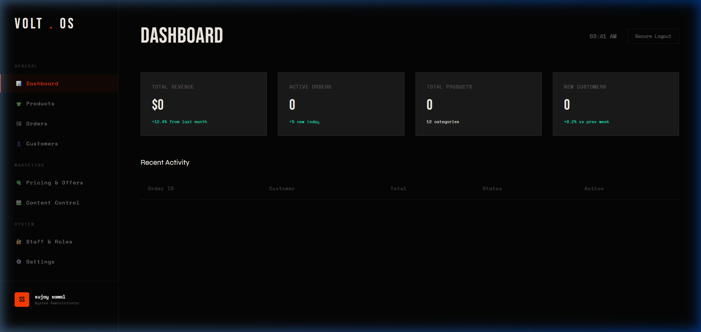

# VOLT — Future Fashion

VOLT is a premium, high-end e-commerce experience designed for the intersection of streetwear and engineered culture. This project features a cutting-edge frontend with dynamic animations, a robust role-based administrative system, and a seamless shopping experience.

## ✨ Key Features

- **Premium UI/UX**: Ultra-modern, dark-themed design with smooth animations, magnetic buttons, and glitch effects.
- **Dynamic Shop**: Live product fetching from a Node.js backend with advanced filtering and search.
- **Advanced Cart & Checkout**: Real-time stock validation, dynamic coupon application, and persistent cart storage.
- **Powerful Admin Panel**: Complete management suite for products, orders, coupons, staff, and live sales analytics.
- **Security**: Role-Based Access Control (RBAC) ensuring secure management of store data.

## 🛠️ Technology Stack

- **Frontend**: Vanilla HTML5, CSS3, JavaScript (ES6+).
- **Backend**: Node.js, Express.js.
- **Database**: JSON-based persistent local storage.

## 📸 Screenshots

### 🏠 Home Page


### 👕 Shop


### 🛒 Cart & Checkout


### 🏠 Home login


### 🔐 Admin Dashboard


## 🚀 Getting Started

1. **Clone the repo**:
   ```bash
   git clone https://github.com/sujay-kr-samal/volt-fasion.git
   ```
2. **Setup Backend**:
   ```bash
   cd volt-fashion/backend
   npm install
   npm start
   ```
3. **Open Frontend**:
   Open `frontend/index.html` in your browser (using a Live Server is recommended).

---
© 2026 VOLT Studio. Engineered for the edge.
